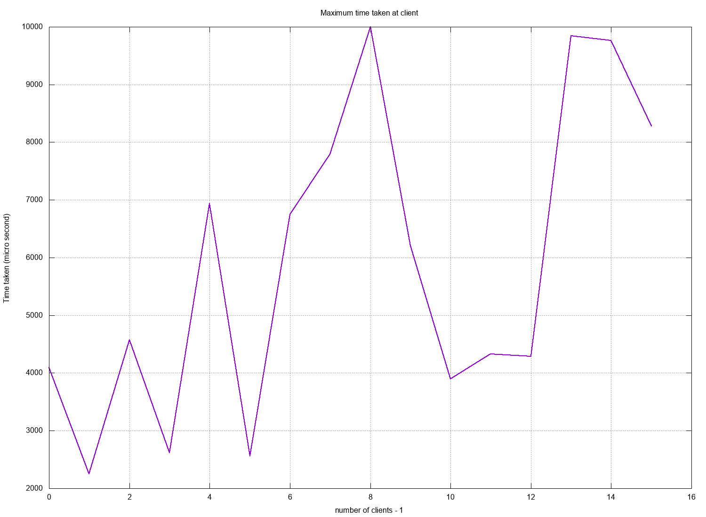
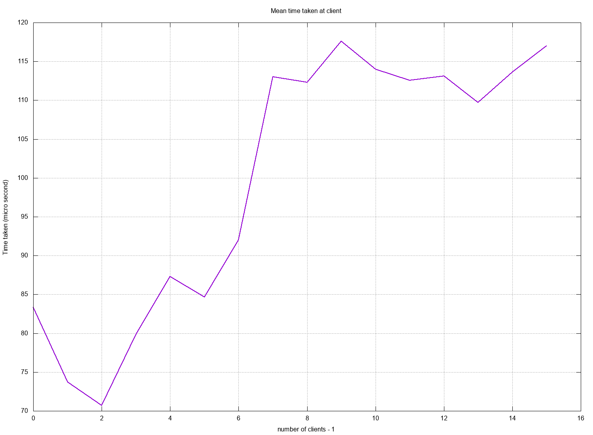
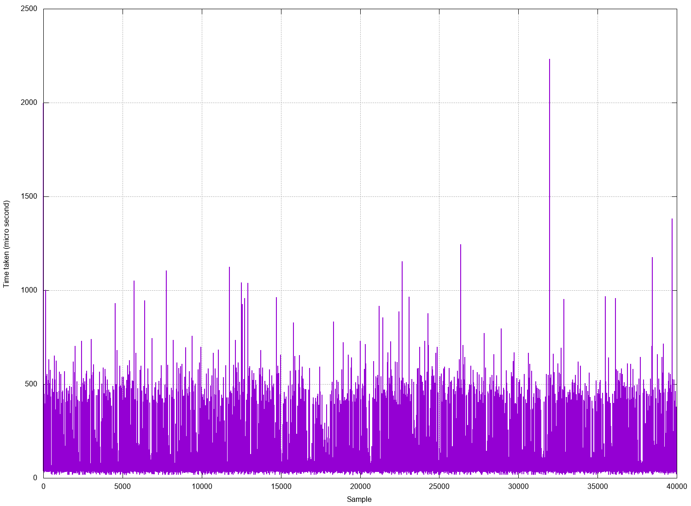
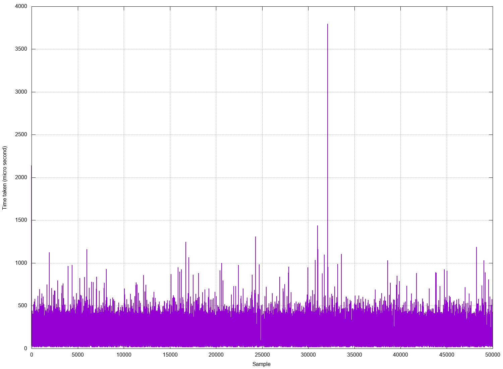
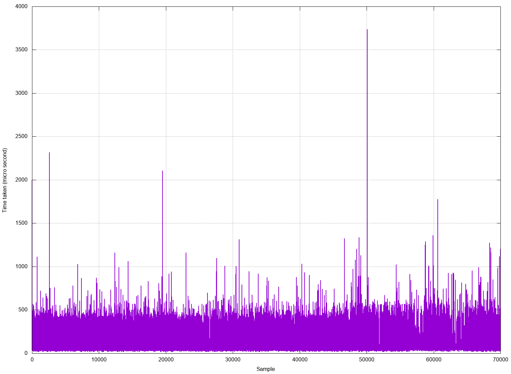
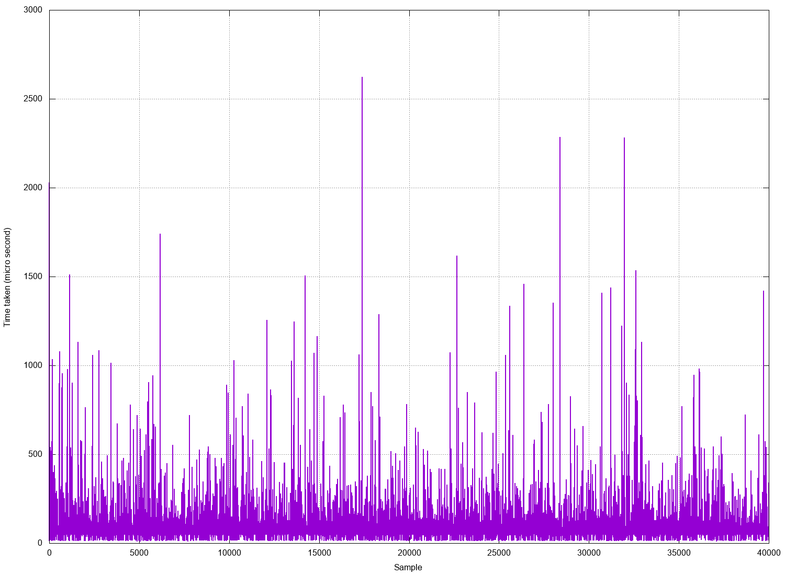
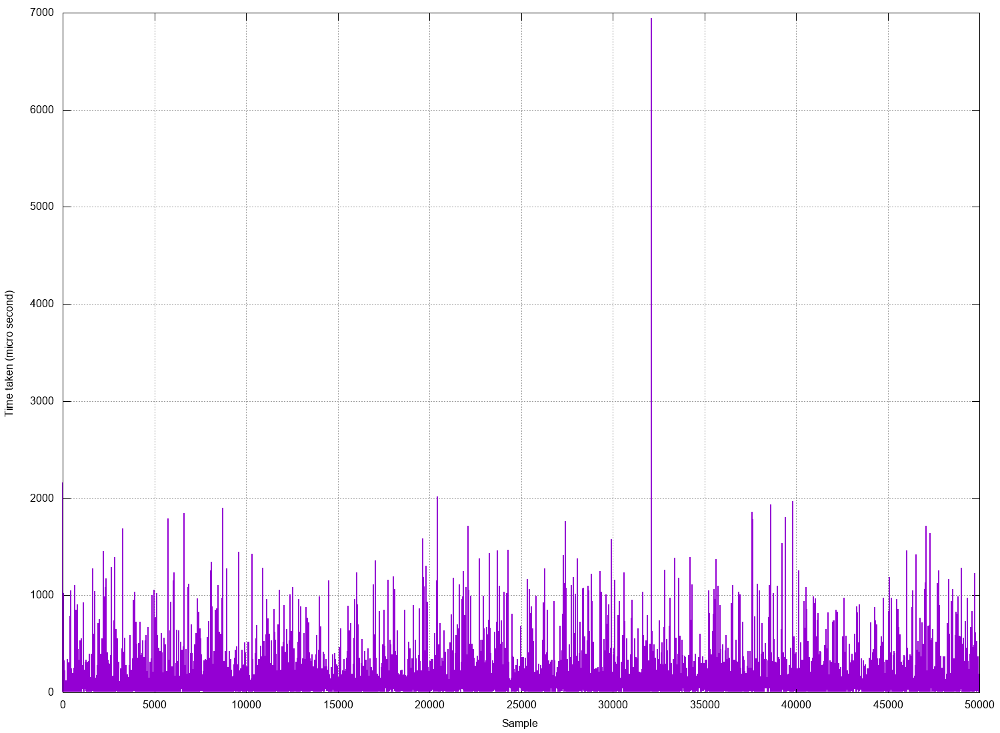
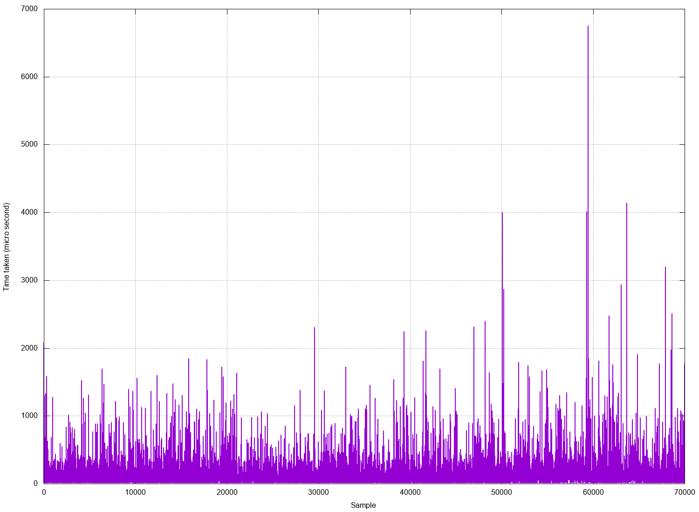

## Database server benchmarks

Benchmarks can be taken using the zsh script benchmark.sh.

## Server

|Maximum|Minimum|Mean|
|--|--|--|
||||

## Client

|Maximum|Minimum|Mean|
|--|--|--|
||||

## Server delay with n clients
||||
|--|--|--|
|Number of clients = 1|Number of clients = 2|Number of clients = 3|
||||
|Number of clients = 4|Number of clients = 5|Number of clients = 6|
||||
|Number of clients = 7|Number of clients = 8|Number of clients = 9|
||||

## Client delay with n clients
||||
|--|--|--|
|Number of clients = 1|Number of clients = 2|Number of clients = 3|
||||
|Number of clients = 4|Number of clients = 5|Number of clients = 6|
||||
|Number of clients = 7|Number of clients = 8|Number of clients = 9|
||||