## Database server benchmarks

Benchmarks can be taken using the `zsh` script [benchmark.sh](./benchmark.sh).

Measurements are made upto **9 simultaneous clients**. Each n-simultaneous-clients simulation is run 500 times and Min, Max, and Mean are calculated. These limits can be changed from scripts [benchmark.sh](./benchmark.sh) and [runner.sh](./runner.sh) respectively. Change the gnuplot file [bm.gp](./bm.gp) to change how the benchmarks are plotted.

Measured data from the benchmarks is available in the [results](./results) folder. When `i` clients are simultaneously running, `client-i.csv` has the measurements from clients and `server-i.csv` has the server measurements. `{client/server}-{min/max/mean}.csv` has the min/max/mean of client/server.

## Server
Time in microseconds from the moment message is received to the moment message send completes. Click on the pictures to enlarge.

|Maximum|Minimum|Mean|
|--|--|--|
|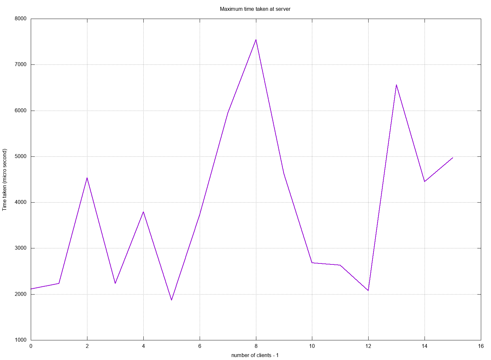|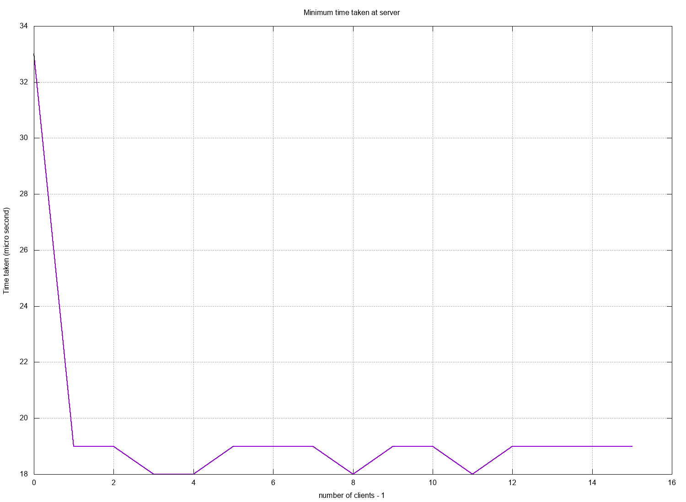|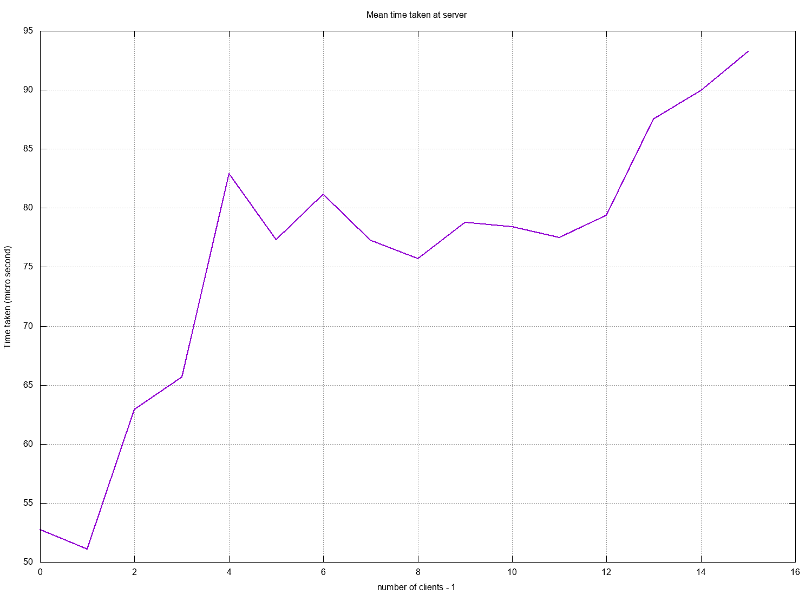|

## Client
Time in microseconds from the moment message is sent to the moment is completely recieved.  Click on the pictures to enlarge. 

|Maximum|Minimum|Mean|
|--|--|--|
||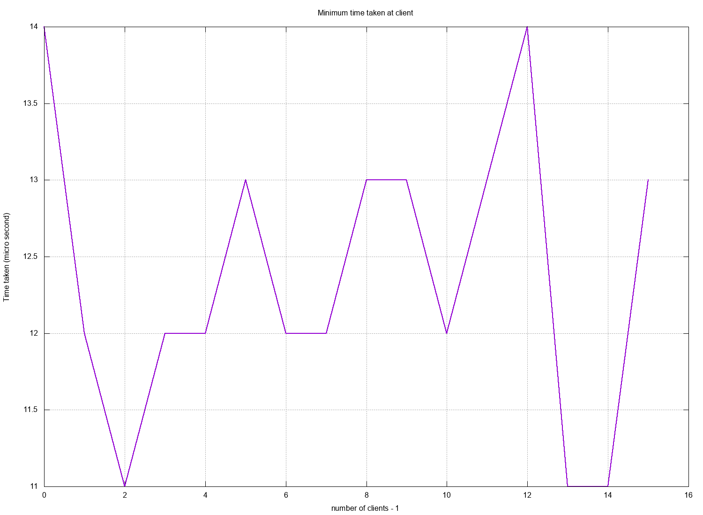||

## Server delay with N clients
`N` clients are run at a time, and this is repeated `500` times. 
For every request from client, server logs the time taken,
so there are `Nx500` samples in the image for n-clients.
Click on the pictures to enlarge.

||||
|--|--|--|
|Number of clients = 1|Number of clients = 2|Number of clients = 3|
|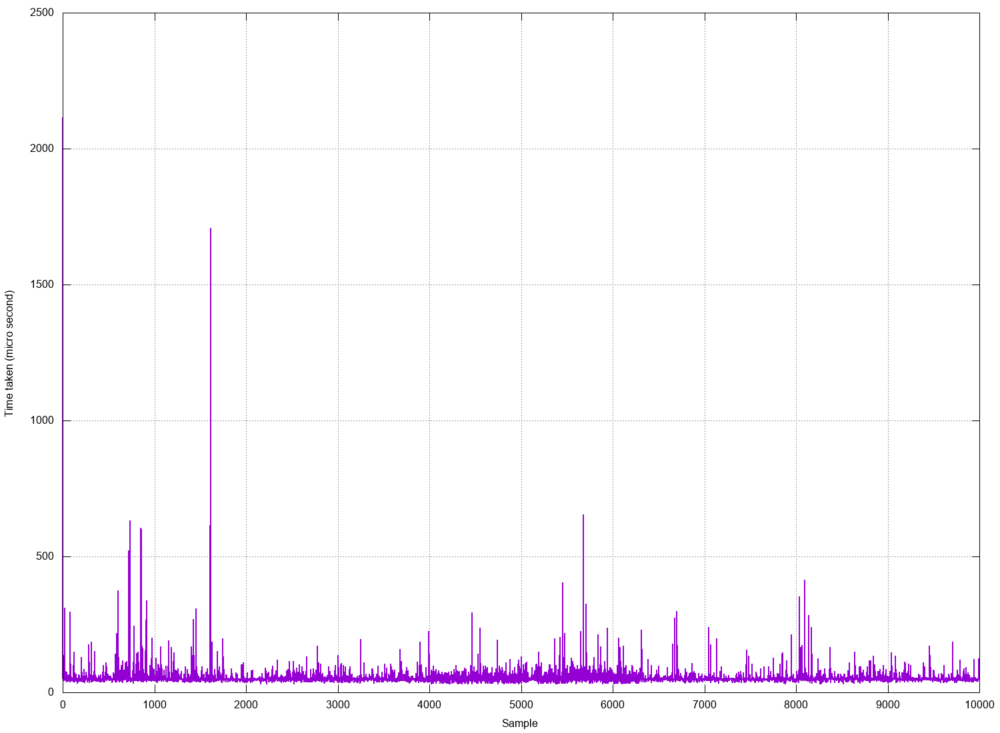||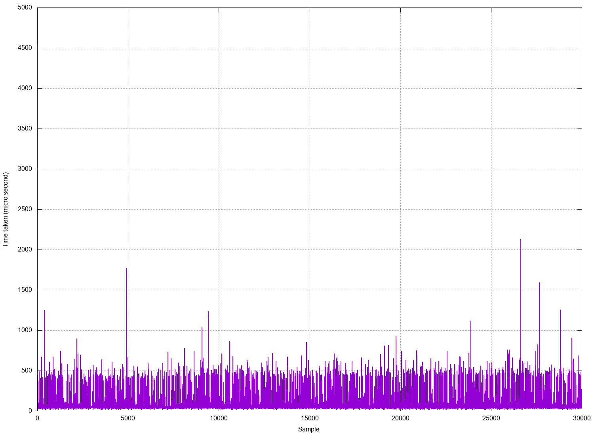|
|Number of clients = 4|Number of clients = 5|Number of clients = 6|
||||
|Number of clients = 7|Number of clients = 8|Number of clients = 9|
|||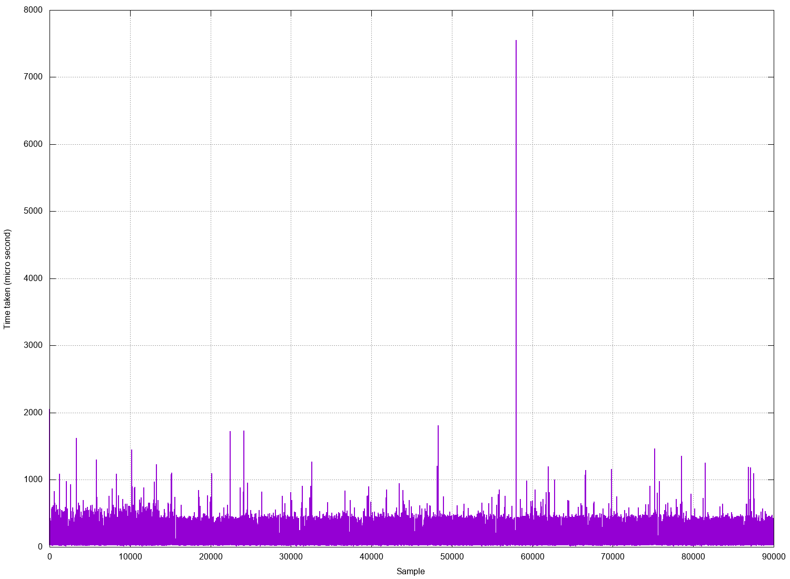|

## Client delay with N clients

`N` clients are run at a time, and this is repeated `500` times. 
All clients measure the time taken and log to a file, 
so there are `Nx500` samples in the image for n-clients.
Click on the pictures to enlarge.

||||
|--|--|--|
|Number of clients = 1|Number of clients = 2|Number of clients = 3|
|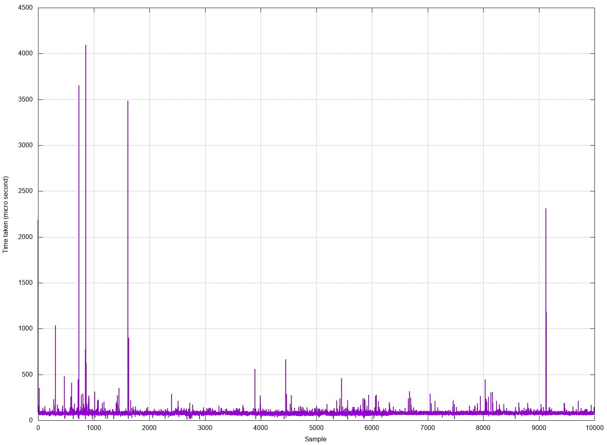|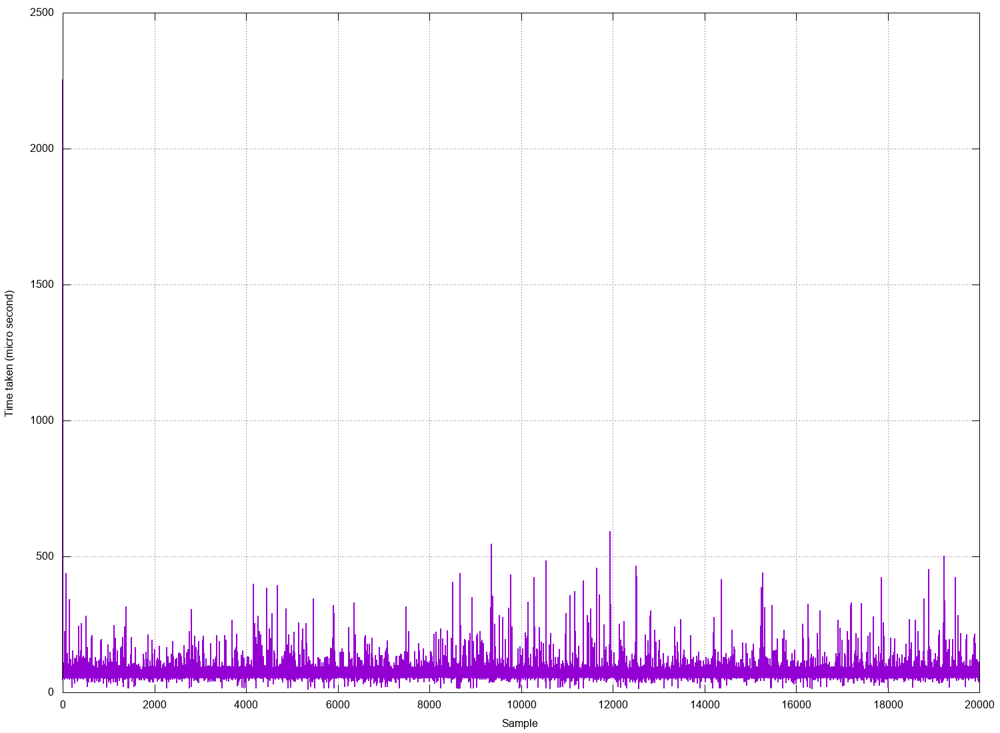|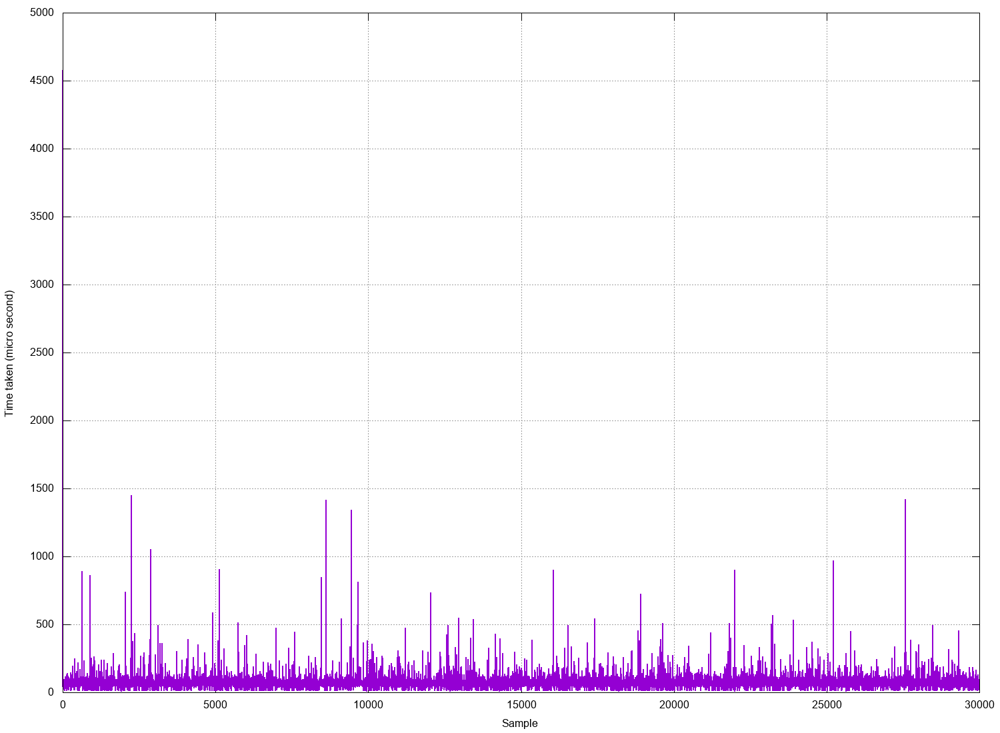|
|Number of clients = 4|Number of clients = 5|Number of clients = 6|
||||
|Number of clients = 7|Number of clients = 8|Number of clients = 9|
|||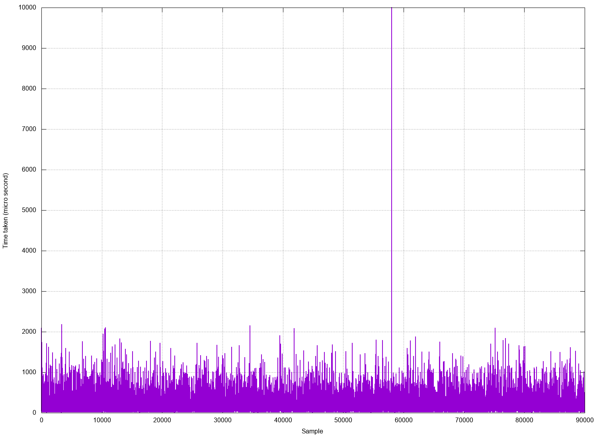|